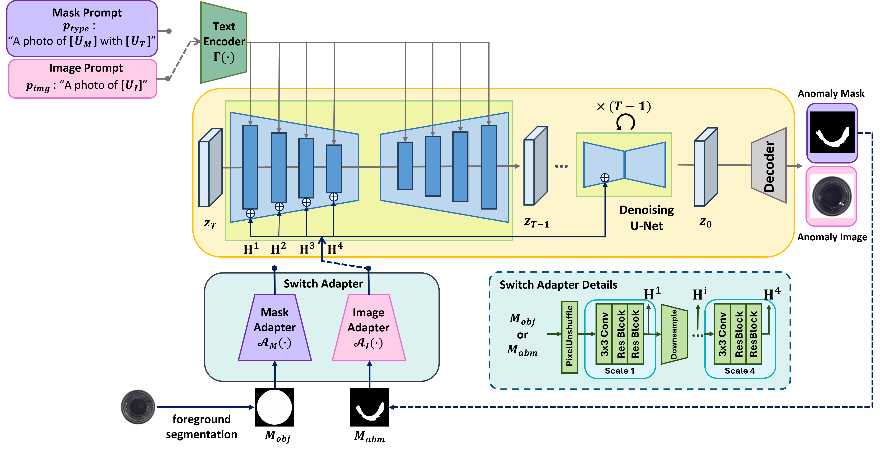

# Anodapter
Anodapter: A Unified Framework for Generating Anomaly and Mask Images Using Diffusion Models
<!-- <br> -->
[Minkyoung Shin<sup>1#</sup>](https://github.com/conel77)



## Dataset
| Data and Models                          | Download                                                                                             | Place at                  |
|------------------------------------------|------------------------------------------------------------------------------------------------------|---------------------------|
| Generated data                           | [Google Drive](https://drive.google.com/drive/folders/19uaBAdhukr1RKxI7qZyGo5cx0mBXEz4_?usp=sharing)   | $path_to_the_generated_data                          |


## Overview
Anodapter is a few-shot anomaly generation model for anomaly inspection.

The overall process is as follows:

1. During the training phase, anomaly images and corresponding masks for each class are learned simultaneously.
2. In the inference phase, an anomaly mask is first generated, followed by the generation of an anomaly image that aligns with the given mask.

## Prepare


### (1) Prepare the environment
```
Ubuntu
python 3.8
cuda==11.8
torch==2.3.0
```
### (2) Prepare MVTec dataset

Download the [MVTec Anomaly Detection (MVTec AD)](https://www.mvtec.com/company/research/datasets/mvtec-ad/) dataset and unzip the archive files under ```./home```.

### (3) Checkpoint for Stable-Diffusion 1.4

Download the official checkpoint of the stable diffusion model:

### (4) How to train 🔥

```bash
cd /home/anodapter/examples/anodapter
bash train_anodapter.sh
```
We train with `MVTec` data precision on `2` NVIDIA `RTX3090` GPUs.

### (5) How to inference 🎈

```
cd /home/anodapter/examples/anodapter
python sample_anodapter.py
```

